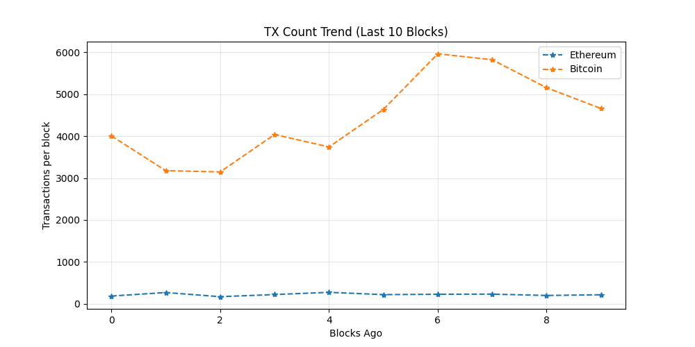
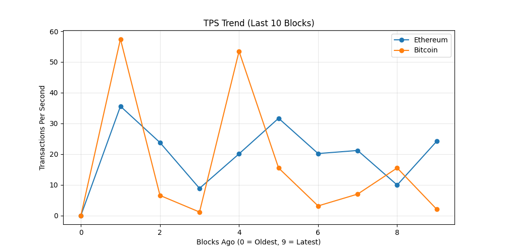
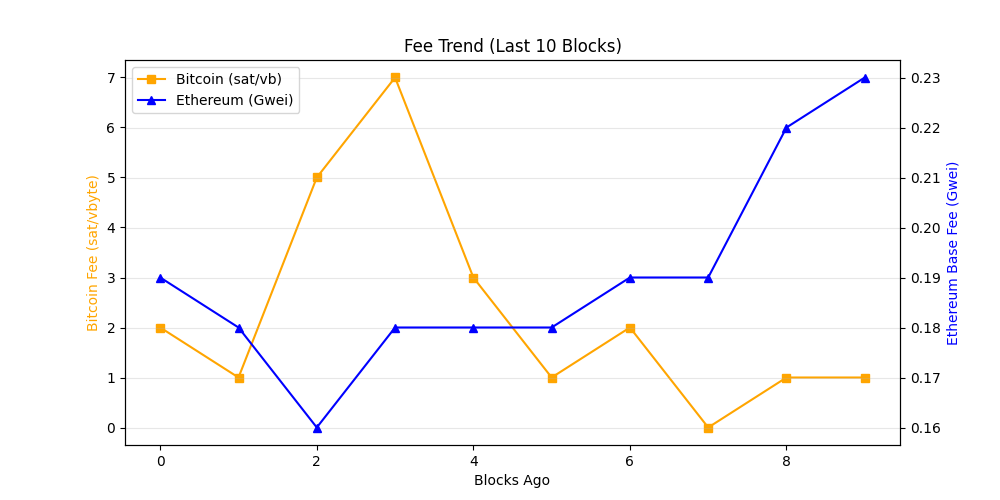

# Crypto Network Reliability Dashboard

Author: Hitesh Agrawal (hitesha1981@gmail.com)

This repository implements an automated, on-chain reliability and activity dashboard
for major blockchain networks using direct JSON-RPC calls via GetBlock.io.

The system periodically runs every 6 hours collects low-level network signals such as:
- latest block height
- transaction throughput per block
- fee pressure indicators
- detection of unusually large (“whale”) value transfers in latest block

All data is gathered directly from blockchain RPC endpoints (no price or market APIs),
rendered into human-readable tables and charts using Python and Matplotlib, and published
as a self-updating README via GitHub Actions.

The README itself acts as the dashboard and is regenerated automatically on a 6 Hour schedule,
demonstrating a production-style, infrastructure-focused observability workflow rather
than a traditional UI-driven approach.

_Last updated: 2026-09-02 04:31 UTC_

## API Usage (GetBlock.io)
- Calls used: **24**

## Network Metrics
| Chain | Block Height | TX Count | TPS (10 blk avg) | Block Util | Avg Fee |
|------|-------------|----------|------------------|------------|---------|
| Ethereum | 25887231 | 145 | 12.08 | 48.59% | 0.1 Gwei |
| Bitcoin | 965119 | 4083 | 1.46 | 99.79% | N/A |

## Visuals
### Transactions Trend


### TPS Trend (Last 10 Blocks)


### Fee Trend


## Whale Alerts (latest block)
- Transaction hashes are truncated for readability.
- Full hashes are available in `dashboards/metrics.json`
- Bitcoin | 256.92 BTC | `788586d37733…`
- Bitcoin | 299.87 BTC | `e6e9c636029d…`
- Bitcoin | 176.43 BTC | `4e2ea73dfea2…`
- Bitcoin | 174.33 BTC | `3cb33253be75…`
- Bitcoin | 161.4 BTC | `da6950eea389…`

## Run locally

```bash
uv sync
export GETBLOCK_ETH_ENDPOINT=https://go.getblock.asia/REDACTED
export GETBLOCK_BTC_ENDPOINT=https://go.getblock.io/REDACTED
uv run python -m scripts.collect_metrics
uv run python -m scripts.render_readme
```
---
**Enabled (Free Tier):**
- Ethereum Mainnet
- Bitcoin Mainnet

---

## What this project demonstrates

- Production-grade RPC usage tracking
- Deterministic CI execution using `uv`
- Separation of chain-specific collectors
- Infrastructure-style observability without UI dependencies
- GitHub Actions used as a scheduler (cron)

---

## How the system works

1. GitHub Actions runs every 6 hours, 15 minute past the hour
2. Chain-specific collectors fetch on-chain metrics
3. API usage is counted centrally
4. Metrics are written to JSON
5. README.md is re-rendered deterministically
6. Updated dashboard is committed back to git

---
